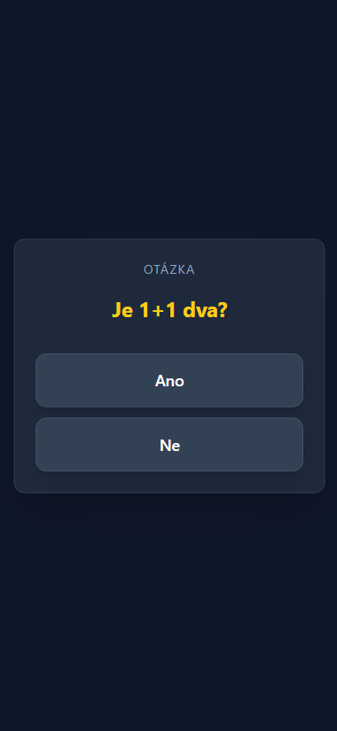
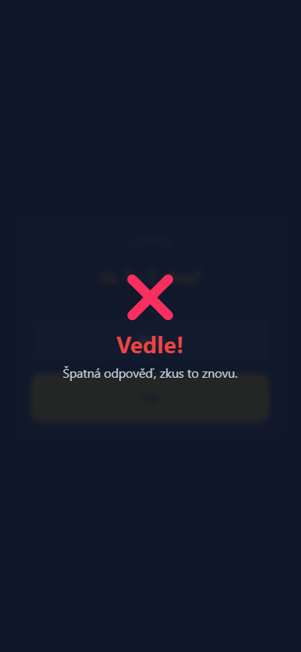
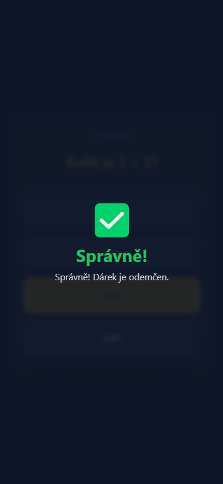
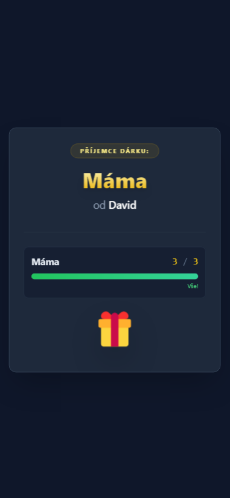

# LAN quiz game

A simple web application, a quiz game where you have to correctly answer a random question from a given set to reveal the recipient of a Christmas gift.

Game was locally hosted on a home server to have some fun with family members. 

Made using FastAPI and Jinja2Templates. 

## Wrapped presents with QR codes

## Screenshots from the web UI

